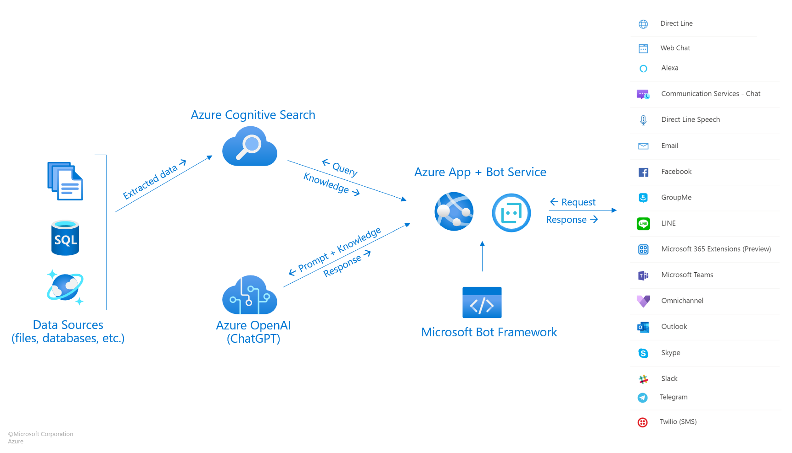
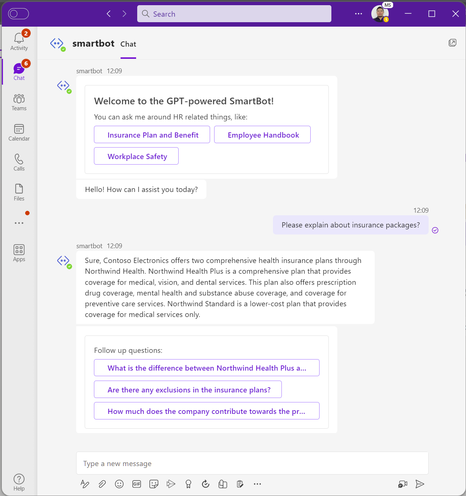
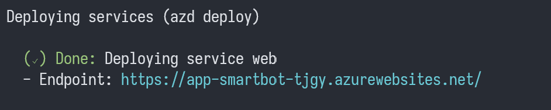
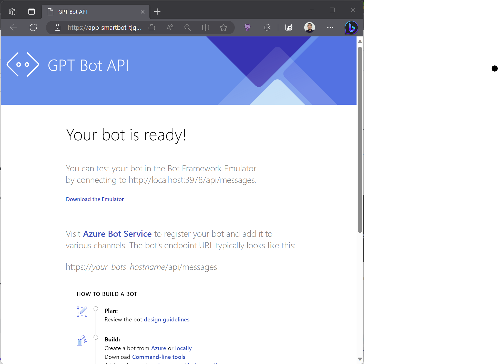
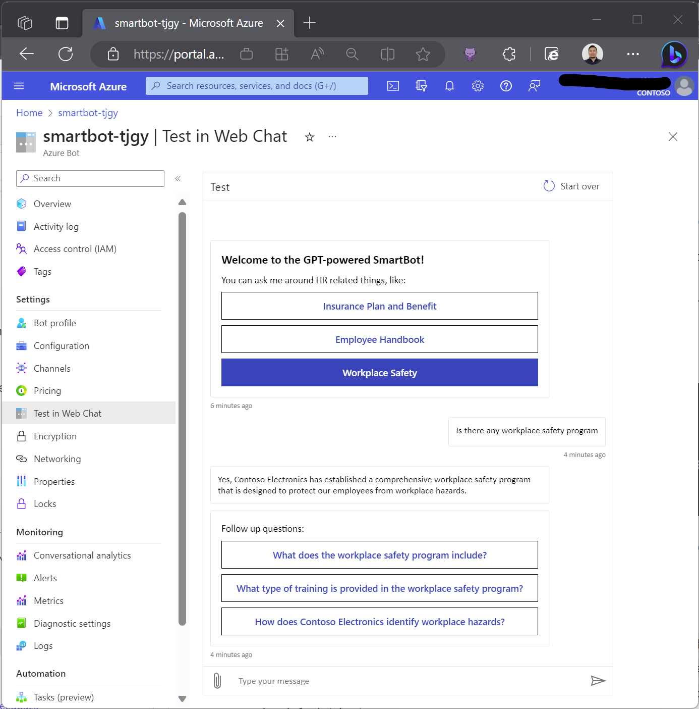

# Chat with your Enterprise Data

## Powered by Azure OpenAI/ChatGPT, Cognitive Search, and Bot Service

This sample demonstrates a few approaches for creating ChatGPT-like experiences over your own data using the Retrieval Augmented Generation pattern together with Azure Bot service and Microsoft Bot Framework so that you can integrate your bot with different communication channels. It also uses Azure OpenAI Service to access the ChatGPT model (gpt-35-turbo), and Azure Cognitive Search for data indexing and retrieval.

The repo includes sample data so it's ready to try end to end. In this sample application we use a fictitious company called Contoso Electronics, and the experience allows its employees to ask questions about the benefits, internal policies, as well as job descriptions and roles.

## Features

* Use Azure Bot Service so that you can integrate your bot with different communication channels: Teams, Slack, etc.
* Response with citations and suggested followup questions.
* As a baseline for different possible approaches for data preparation, prompt construction, and orchestration of interaction between model (ChatGPT) and retriever (Cognitive Search)

## Getting Started

> **IMPORTANT:** In order to deploy and run this example, you'll need an **Azure subscription with access enabled for the Azure OpenAI service**. You can request access [here](https://aka.ms/oaiapply). You can also visit [here](https://azure.microsoft.com/free/cognitive-search/) to get some free Azure credits to get you started.

> **AZURE RESOURCE COSTS** by default this sample will create Azure App Service and Azure Cognitive Search resources that have a monthly cost, as well as Form Recognizer resource that has cost per document page. You can switch them to free versions of each of them if you want to avoid this cost by changing the parameters file under the infra folder (though there are some limits to consider; for example, you can have up to 1 free Cognitive Search resource per subscription, and the free Form Recognizer resource only analyzes the first 2 pages of each document.)

### Prerequisites

#### To Run Locally
- [Azure Developer CLI](https://aka.ms/azure-dev/install)
- [.NET 7.0](https://dotnet.microsoft.com/en-us/download)
- [Bot Framework Emulator](https://github.com/Microsoft/BotFramework-Emulator/releases/tag/v4.14.1) if you want to test it locally
- [Git](https://git-scm.com/downloads)
- [Powershell 7+ (pwsh)](https://github.com/powershell/powershell) - For Windows users only.
   - **Important**: Ensure you can run `pwsh.exe` from a PowerShell command. If this fails, you likely need to upgrade PowerShell.

>NOTE: Your Azure Account must have `Microsoft.Authorization/roleAssignments/write` permissions, such as [User Access Administrator](https://learn.microsoft.com/azure/role-based-access-control/built-in-roles#user-access-administrator) or [Owner](https://learn.microsoft.com/azure/role-based-access-control/built-in-roles#owner).  

#### To Run in GitHub Codespaces or VS Code Remote Containers

You can run this repo virtually by using GitHub Codespaces or VS Code Remote Containers.  Click on one of the buttons below to open this repo in one of those options.

### Installation

#### Project Initialization

1. Clone the source-code `git clone https://github.com/ronikurnia1/gpt-azure-botservice.git` 
2. Run `cd .\gpt-azure-botservice`
4. Run `azd auth login`
5. Run `azd init --location eastus --subscription [00000000-0000-0000-0000-000000000000] --environment mybot --no-prompt`
    * For the target location, the regions that currently support the models used in this sample are **East US** or **South Central US**. For an up-to-date list of regions and models, check [here](https://learn.microsoft.com/en-us/azure/cognitive-services/openai/concepts/models)

#### Starting from scratch:

Execute the following command, if you don't have any pre-existing Azure services and want to start from a fresh deployment.

1. Run `azd up` - This will provision Azure resources and deploy this sample to those resources, including building the search index based on the files found in the `./data` folder.
2. After the application has been successfully deployed you will see a URL printed to the console.  Click that URL to see if Bot API is up and running.  

    
> NOTE: It may take couple of minutes for the application to be fully deployed.

The URL endpoint will look like the following:

The Bot API will look like the following:

3. Open you Azure portal and navigate to "Test in Web Chat" of your Azure Bot Service to test the bot. It will look like the following:

## Resources

* [Revolutionize your Enterprise Data with ChatGPT: Next-gen Apps w/ Azure OpenAI and Cognitive Search](https://aka.ms/entgptsearchblog)
* [Azure Cognitive Search](https://learn.microsoft.com/azure/search/search-what-is-azure-search)
* [Azure OpenAI Service](https://learn.microsoft.com/azure/cognitive-services/openai/overview)

### Note
>Note: The PDF documents used in this demo contain information generated using a language model (Azure OpenAI Service). The information contained in these documents is only for demonstration purposes and does not reflect the opinions or beliefs of Microsoft. Microsoft makes no representations or warranties of any kind, express or implied, about the completeness, accuracy, reliability, suitability or availability with respect to the information contained in this document. All rights reserved to Microsoft.

### FAQ

***Question***: Why do we need to break up the PDFs into chunks when Azure Cognitive Search supports searching large documents?

***Answer***: Chunking allows us to limit the amount of information we send to OpenAI due to token limits. By breaking up the content, it allows us to easily find potential chunks of text that we can inject into OpenAI. The method of chunking we use leverages a sliding window of text such that sentences that end one chunk will start the next. This allows us to reduce the chance of losing the context of the text.
